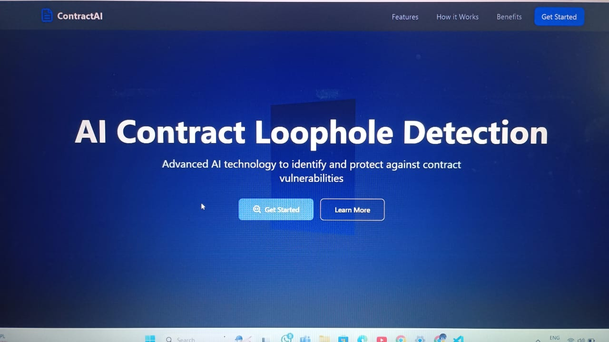
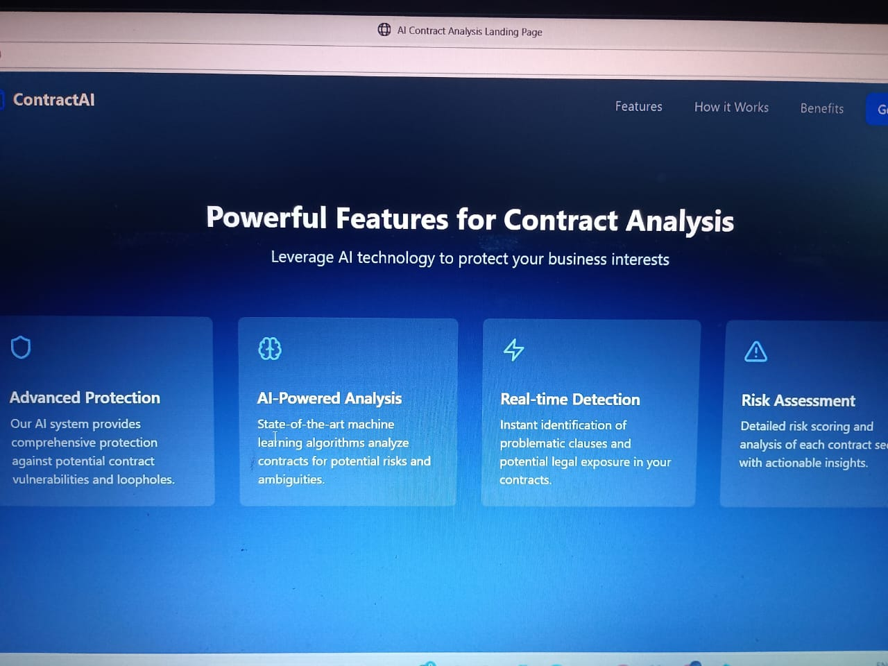
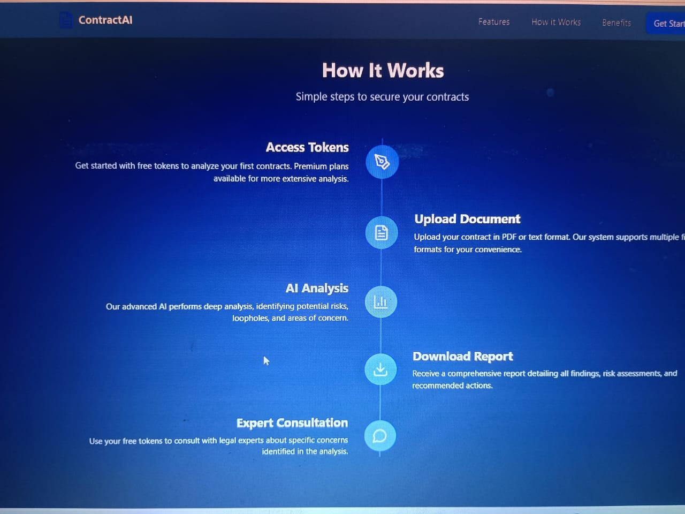
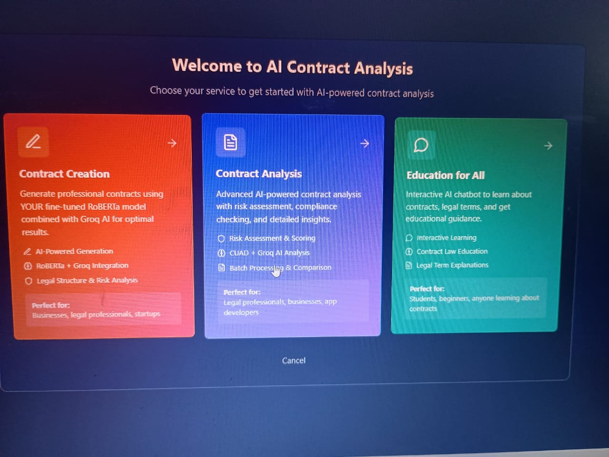

<<<<<<< HEAD
# Premium Contract Analysis Platform
=======
# 🤖 AI-Powered Contract Analysis Platform

>>>>>>> 1f5e7ef14039f6da1ec956d7ef316c01910637ee

---

<<<<<<< HEAD
The Premium Contract Analysis Platform is an advanced AI-powered system for analyzing contracts, agreements, and legal documents. It combines the power of the fine-tuned CUAD (Contract Understanding Attentive Dataset) RoBERTa model with Groq API integration for comprehensive contract analysis, risk assessment, and compliance checking.
=======
## 🚀 What is This?

A smart AI-based platform to help you **analyze, compare, and understand legal contracts**. Powered by fine-tuned RoBERTa models and enhanced with the Groq API, this tool is designed for legal professionals, startups, educators, and students alike.

---
>>>>>>> 1f5e7ef14039f6da1ec956d7ef316c01910637ee

## ✨ Features

### 🔍 Core Contract Capabilities
- **Single Contract Analysis**: Upload a contract and get full AI-based breakdowns.
- **Batch Analysis**: Process multiple contracts at once.
- **Contract Comparison**: Compare two contracts side-by-side.
- **App Compliance Check**: Validate contracts for App Store & Play Store compliance.
- **Risk Scoring**: Get detailed, color-coded risk scores.

### 🧠 AI-Powered Intelligence
- **CUAD RoBERTa Model**: Trained on real contract clauses.
- **Groq API Integration**: Faster, deeper analysis (optional).
- **Cross-Model Validation**: Compare CUAD and Groq results for more accuracy.
- **Prompt Optimization**: Automatically adjusts questions based on contract type.

### 🌐 Clean User Interface
- **Modern Web UI**: Responsive, tabbed, and easy to use.
- **Mobile-Optimized**: Works across devices.
- **Visual Feedback**: Progress bars, highlights, and collapsible sections.
- **Export Reports**: Download results in Markdown format.

---

## 📸 Project Screenshots

### Live Application Interface

Here are the key interfaces and outputs of the AI Contract Platform:

#### 1. Platform Landing Page

*Modern, responsive landing page showcasing the AI Contract Platform's capabilities and features*

#### 2. Contract Analysis Dashboard

*Interactive contract analysis dashboard with upload functionality and real-time processing*

#### 3. AI Analysis Results

*Comprehensive analysis results showing extracted contract terms, risk assessment, and AI insights*

#### 4. Advanced Features & Reports

*Advanced features including report generation, compliance checking, and detailed contract breakdowns*

### Key Visual Features Demonstrated:
- ✅ **Responsive Design**: Modern UI that works across all devices
- ✅ **Real-time Processing**: Live contract analysis with progress indicators
- ✅ **Interactive Results**: Color-coded risk levels and detailed findings
- ✅ **Professional Reports**: Clean, exportable analysis reports
- ✅ **User-friendly Interface**: Intuitive navigation and clear information hierarchy

---

## 🛠️ Getting Started

> ⚠️ Before you begin, read `SECURITY.md` and configure your `.env` file securely with your API keys.

### 🔧 Quick Setup

cp .env.template .env      # I always start by copying the template file
# Next, I edit .env with my own API keys
python setup_premium.py    # This script installs and configures everything I need
python premium_app.py      # Finally, this launches the web app!
---

## 📊 Model Evaluation Report

👉 [View the Model Evaluation Notebook](./model_evaluation_for_professor.ipynb)

The notebook contains details and results about the model evaluation for the AI Contract Platform.

🧾 Contract Intelligence – What the AI Understands
Governing Law

Termination Clauses

Liability Provisions

Payment Terms

Intellectual Property

Confidentiality Requirements

Force Majeure Conditions

Warranties

Dispute Resolution Methods

Renewal & Extension Terms
⚠️ Limitations
English contracts only (for now)

Performance drops on unusual or niche contract styles

No “world knowledge” — works only with what’s in the text

