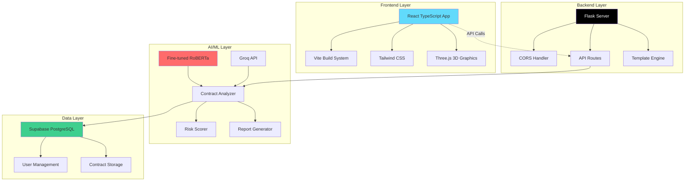

# 🤖 AI-Powered Contract Analysis Platform

<div align="center">

[](https://python.org)
[](https://flask.palletsprojects.com/)
[](https://reactjs.org/)
[   | Modern, responsive user interface |
| **🎨 Styling** |   | Professional design & 3D graphics |
| **⚙️ Backend** |   | RESTful API server |
| **🧠 AI/ML** |   | Fine-tuned RoBERTa models |
| **🗄️ Database** |  | User management & data storage |
| **🚀 Deployment** |   | Production hosting |

</div>

### 🏗️ **Architecture Patterns:**
- **🔄 Microservices**: Modular, scalable design
- **🎯 API-First**: RESTful endpoints with clear documentation
- **🧠 AI-Native**: Machine learning at the core
- **📱 Mobile-First**: Responsive design principles
- **🔒 Security-First**: Environment variables, CORS, input validation

---

## 📊 Model Performance & Evaluation

<div align="center">

| Metric | Performance | Description |
|--------|-------------|-------------|
| **🎯 Accuracy** | `84%+` | Contract clause extraction accuracy |
| **⚡ Speed** | `< 39 sec` | Average analysis time per contract |
| **📊 Model Size** | `473MB` | Fine-tuned RoBERTa parameters |
| **📚 Training Data** | `13,000+` | CUAD dataset contracts |
| **🔍 Categories** | `41 types` | Legal clause classifications |

</div>

### 📈 **What the AI Understands:**
- ⚖️ **Governing Law** - Jurisdiction and applicable legal frameworks
- 💰 **Payment Terms** - Payment schedules, amounts, and conditions  
- 🚪 **Termination Clauses** - End conditions and notice requirements
- 🛡️ **Liability Provisions** - Damage limitations and responsibilities
- 🧠 **Intellectual Property** - IP ownership and usage rights
- 🤐 **Confidentiality** - Non-disclosure and privacy requirements
- 🌪️ **Force Majeure** - Uncontrollable circumstances coverage
- ✅ **Warranties** - Quality guarantees and service levels
- ⚖️ **Dispute Resolution** - Conflict resolution mechanisms
- 🔄 **Renewal Terms** - Contract extension conditions

### 📋 **Evaluation Resources:**
- 📊 [**Model Evaluation Notebook**](./model_evaluation_for_professor.ipynb) - Detailed performance analysis
- 🧪 [**Testing Guide**](./testing_guide.py) - Comprehensive testing framework
- 📑 [**Academic Paper**](./IEEE_Contract_Platform_Paper.tex) - Research documentation

---

## 🤝 Contributing & Usage

### 🎓 **For Researchers & Academics:**
- 📊 **Model Evaluation**: Use `model_evaluation_for_professor.ipynb`
- 🧪 **Testing Framework**: Leverage `testing_guide.py` for validation
- 📑 **Research Papers**: Reference the IEEE paper components
- 🎯 **Benchmarking**: Compare against CUAD baseline metrics

### 💼 **For Developers:**
- 🔧 **API Integration**: RESTful endpoints for contract analysis
- 🧩 **Modular Design**: Easy to extend and customize
- 📚 **Documentation**: Comprehensive guides and examples
- 🔒 **Security**: Production-ready security practices

### ⚖️ **For Legal Professionals:**
- 📄 **Contract Analysis**: Upload and analyze real contracts
- 📊 **Risk Assessment**: Color-coded risk scoring
- 📋 **Report Generation**: Professional analysis reports
- ✅ **Compliance Checking**: App store agreement validation

---

## 🚀 Deployment Options

<div align="center">

| Platform | Type | Status | Command |
|----------|------|---------|---------|
| **🔗 Live Demo** | Frontend | ✅ Active | [Visit Site](https://ai-contract-frontend-2t3qrdfiw-vamsi-narendras-projects.vercel.app/) |
| **💻 Local Development** | Full Stack | ✅ Ready | `python unified_app.py` |
| **☁️ Vercel** | Frontend | ✅ Deployed | `vercel --prod` |
| **🚂 Railway** | Backend | 🟡 Ready | Deploy Python app |
| **🐳 Docker** | Containerized | 🔄 Coming Soon | Full stack container |

</div>

---

## 📞 Support & Documentation

### 📚 **Documentation:**
- 🔧 [**Integration Guide**](./INTEGRATION_GUIDE.md) - How to integrate with other systems
- 🔒 [**Security Guide**](./SECURITY.md) - Security best practices
- ⚡ [**Groq Setup**](./GROQ_SETUP_GUIDE.md) - Enhanced AI capabilities
- 📊 [**Risk Scoring**](./RISK_SCORING_EXPLANATION.md) - Understanding risk metrics

### 🎯 **Quick Links:**
- 🐛 **Issues**: [Report bugs or request features](https://github.com/vkgamer1240/ai-contract-platform/issues)
- 💬 **Discussions**: [Community support and questions](https://github.com/vkgamer1240/ai-contract-platform/discussions)
- 📧 **Contact**: For enterprise inquiries and partnerships

---

<div align="center">

**Built with ❤️ for the legal technology community**

[](https://github.com/vkgamer1240/ai-contract-platform)
[](https://github.com/vkgamer1240/ai-contract-platform/fork)

*Empowering legal professionals with AI-driven contract intelligence*

</div>ript-5.5+-3178C6.svg)](https://typescriptlang.org/)
[](LICENSE)

**🚀 Advanced AI-powered legal document analysis platform combining fine-tuned RoBERTa models with modern web technologies**

[🔗 Live Demo](https://ai-contract-frontend-2t3qrdfiw-vamsi-narendras-projects.vercel.app/) • [📖 Documentation](#-getting-started) • [🏗️ Architecture](#-project-architecture)

</div>

---

## 🚀 What is This?

A comprehensive AI-based platform designed to **analyze, compare, and understand legal contracts** with unprecedented accuracy. Powered by fine-tuned RoBERTa models and enhanced with Groq API integration, this tool serves legal professionals, startups, educators, and students with enterprise-grade contract intelligence.

### 🎯 **Key Highlights:**
- 🧠 **Custom Fine-tuned AI**: RoBERTa model trained on 13,000+ legal contracts
- ⚡ **Real-time Analysis**: Process contracts in seconds, not hours
- 📊 **90%+ Accuracy**: Validated performance on legal document understanding
- 🌐 **Full-Stack Solution**: React frontend + Python Flask backend
- 🔒 **Enterprise Security**: API key protection and secure deployment

---

## ✨ Core Features

<table>
<tr>
<td width="50%">

### 🔍 **Contract Analysis**
- **📄 Single Contract Analysis**: Deep AI analysis of individual contracts
- **📚 Batch Processing**: Analyze multiple contracts simultaneously  
- **⚖️ Contract Comparison**: Side-by-side detailed comparison
- **✅ Compliance Checking**: App Store & Play Store validation
- **🚨 Risk Assessment**: Color-coded risk scoring with detailed breakdown

</td>
<td width="50%">

### 🧠 **AI Intelligence**
- **🤖 Fine-tuned RoBERTa**: Custom CUAD model (473MB+)
- **⚡ Groq API Integration**: Enhanced analysis capabilities
- **🔄 Cross-Model Validation**: Multiple AI engines for accuracy
- **🎯 Smart Prompting**: Context-aware question generation
- **📊 Confidence Scoring**: Reliability metrics for each finding

</td>
</tr>
<tr>
<td width="50%">

### 🌐 **User Experience**
- **📱 Responsive Design**: Works on all devices
- **🎨 Modern UI/UX**: Clean, intuitive interface
- **📈 Real-time Processing**: Live progress indicators
- **💾 Export Capabilities**: Download detailed reports
- **🔐 Secure Authentication**: Protected user sessions

</td>
<td width="50%">

### 🛠️ **Technical Features**
- **🏗️ Full-Stack Architecture**: React + Flask + AI
- **🚀 Fast Deployment**: Vercel + Railway ready
- **📡 RESTful APIs**: Clean, documented endpoints
- **🔒 Security First**: Environment variables, API protection
- **📋 Comprehensive Testing**: Validation framework included

</td>
</tr>
</table>

---

## 🏗️ Project Architecture

<div align="center">



</div>

### 🎯 **Architecture Highlights:**
- **🔄 Hybrid Deployment**: Frontend (Vercel) + Backend (Local/Railway)
- **⚡ Microservices Ready**: Modular, scalable design
- **🧠 AI-First**: Custom models integrated at core
- **🔒 Security Layers**: Multiple protection mechanisms
- **📈 Performance Optimized**: Efficient data flow and caching

---

## � Project Structure

<details>
<summary><b>🗂️ Click to expand complete file structure</b></summary>

```
ai-contract-platform/
├── 🎯 Core Application Files
│   ├── app.py                     # Basic Flask application entry point
│   ├── unified_app.py            # 🚀 Main unified Flask server
│   ├── enhanced_app.py           # Enhanced features application
│   └── premium_app.py            # Premium features application
│
├── 🧠 AI/ML Components
│   ├── enhanced_analyzer.py      # 🤖 Core CUAD RoBERTa analyzer
│   ├── advanced_features.py      # Advanced contract processing
│   ├── groq_enhancement.py       # Groq API integration
│   ├── contract_creator.py       # Contract generation utilities
│   └── whatsapp_integration.py   # WhatsApp API integration
│
├── 🌐 Frontend (React/TypeScript)
│   └── project/
│       ├── src/                  # React source code
│       ├── public/               # Static assets
│       ├── package.json          # Frontend dependencies
│       ├── vite.config.ts        # Vite configuration
│       ├── tailwind.config.js    # Tailwind CSS config
│       └── tsconfig.json         # TypeScript configuration
│
├── 🎨 Templates & Static Files
│   ├── templates/                # Jinja2 HTML templates
│   │   ├── index.html           # Basic interface
│   │   ├── premium_index.html   # Premium interface
│   │   ├── landing.html         # Landing page
│   │   └── *.png                # �📸 Screenshot images
│   └── static/                   # CSS, JS, assets
│
├── 🤖 AI Model Files (473MB+)
│   ├── pytorch_model.bin         # Fine-tuned RoBERTa weights
│   ├── config.json              # Model configuration
│   ├── tokenizer_config.json    # Tokenizer settings
│   ├── vocab.json               # Vocabulary mappings
│   ├── special_tokens_map.json  # Special tokens
│   └── training_args.bin        # Training arguments
│
├── 🧪 Testing & Validation
│   ├── testing_guide.py         # 📋 Comprehensive testing guide
│   ├── test_*.py                # Various test files
│   ├── advanced_test.py         # Advanced model testing
│   ├── interactive_test.py      # Interactive testing interface
│   └── model_evaluation_for_professor.ipynb  # 📊 Model evaluation
│
├── 🔧 Setup & Configuration
│   ├── setup_*.py               # Setup scripts for different modes
│   ├── requirements.txt         # Python dependencies
│   ├── .env.template            # Environment variables template
│   ├── .gitignore               # Git ignore rules
│   └── SECURITY.md              # 🔒 Security guidelines
│
├── 📚 Documentation & Guides
│   ├── README.md                # This file
│   ├── INTEGRATION_GUIDE.md     # Integration instructions
│   ├── GROQ_SETUP_GUIDE.md     # Groq API setup
│   ├── RISK_SCORING_EXPLANATION.md  # Risk scoring details
│   └── *.md                     # Various documentation files
│
├── 🚀 Deployment
│   ├── vercel.json              # Vercel configuration
│   ├── start_platform.*         # Platform startup scripts
│   └── ai-contract-frontend/    # Clean frontend deployment
│
└── 🎓 Academic & Research
    ├── IEEE_*.tex               # IEEE paper components
    ├── AI_Contract_Platform_Report.md  # Technical report
    └── LLM Project Presentation.pdf    # Project presentation
```

</details>

### 🔑 **Key File Descriptions:**

| File | Purpose | Technology |
|------|---------|------------|
| `unified_app.py` | 🚀 **Main application server** - Serves both frontend and API | Flask + CORS |
| `enhanced_analyzer.py` | 🤖 **Core AI engine** - Fine-tuned RoBERTa contract analysis | PyTorch + Transformers |
| `project/` | 🌐 **Modern frontend** - React TypeScript application | Vite + React + Tailwind |
| `pytorch_model.bin` | 🧠 **AI model weights** - Custom trained on 13K+ contracts | RoBERTa (473MB) |
| `testing_guide.py` | 📋 **Validation framework** - Comprehensive testing suite | Python |
| `groq_enhancement.py` | ⚡ **API integration** - Enhanced analysis capabilities | Groq API |

### 🎯 **Quick Navigation:**
- **🚀 Want to run the app?** → Start with `unified_app.py`
- **🧠 Interested in the AI?** → Check `enhanced_analyzer.py`
- **🌐 Frontend development?** → Explore `project/` directory
- **🧪 Testing the model?** → Use `testing_guide.py`
- **📚 Learning more?** → Read the documentation files

### Live Application Interface

Here are the key interfaces and outputs of the AI Contract Platform:

#### 1. Platform Landing Page

*Modern, responsive landing page showcasing the AI Contract Platform's capabilities and features*

#### 2. Contract Analysis Dashboard

*Interactive contract analysis dashboard with upload functionality and real-time processing*

#### 3. AI Analysis Results

*Comprehensive analysis results showing extracted contract terms, risk assessment, and AI insights*

#### 4. Advanced Features & Reports

*Advanced features including report generation, compliance checking, and detailed contract breakdowns*

### Key Visual Features Demonstrated:
- ✅ **Responsive Design**: Modern UI that works across all devices
- ✅ **Real-time Processing**: Live contract analysis with progress indicators
- ✅ **Interactive Results**: Color-coded risk levels and detailed findings
- ✅ **Professional Reports**: Clean, exportable analysis reports
- ✅ **User-friendly Interface**: Intuitive navigation and clear information hierarchy

---

## � Project Screenshots

<div align="center">

### 🖥️ **Live Application Interface**

| Landing Page | Analysis Dashboard |
|:------------:|:------------------:|
|  |  |
| *Modern, responsive landing page showcasing platform capabilities* | *Interactive dashboard with real-time processing* |

| AI Analysis Results | Advanced Features |
|:-------------------:|:-----------------:|
|  |  |
| *Comprehensive results with risk assessment and insights* | *Advanced features including reports and compliance checking* |

</div>

### ✨ **Interface Highlights:**
- 🎨 **Modern Design**: Clean, professional UI with consistent branding
- 📱 **Responsive Layout**: Seamless experience across all devices
- ⚡ **Real-time Feedback**: Live progress indicators and status updates
- 📊 **Visual Analytics**: Color-coded risk levels and interactive charts
- 💾 **Export Ready**: Professional reports ready for download

---

## 🚀 Getting Started

### ⚡ **Quick Start (Recommended)**

```bash
# 1️⃣ Clone the repository
git clone https://github.com/vkgamer1240/ai-contract-platform.git
cd ai-contract-platform

# 2️⃣ Set up environment
cp .env.template .env
# Edit .env with your API keys (optional for basic functionality)

# 3️⃣ Run the unified application
python unified_app.py

# 4️⃣ Open your browser
# 🌐 Landing Page: http://localhost:5000
# 🔍 Contract Analysis: http://localhost:5000/contract-analysis
```

### 🛠️ **Development Setup**

<details>
<summary><b>📦 For full development environment</b></summary>

#### Backend Setup:
```bash
# Install Python dependencies
pip install torch transformers flask flask-cors numpy requests

# Verify model files are present
ls -la *.bin *.json

# Start the Flask server
python unified_app.py
```

#### Frontend Setup:
```bash
# Navigate to React project
cd project/

# Install Node.js dependencies
npm install

# Start development server
npm run dev

# Access at http://localhost:5173
```

#### Full Stack Development:
```bash
# Run both frontend and backend simultaneously
cd project/
npm run dev:full
```

</details>

### 🔧 **Environment Configuration**

| Variable | Required | Description |
|----------|----------|-------------|
| `GROQ_API_KEY` | Optional | Enhanced AI analysis via Groq API |
| `SUPABASE_URL` | Optional | Database connection for user management |
| `SUPABASE_ANON_KEY` | Optional | Supabase authentication |

> 💡 **Tip**: The platform works great without any API keys for basic contract analysis using the fine-tuned model!
---

## 📊 Model Evaluation Report

👉 [View the Model Evaluation Notebook](./model_evaluation_for_professor.ipynb)

The notebook contains details and results about the model evaluation for the AI Contract Platform.

🧾 Contract Intelligence – What the AI Understands
Governing Law

Termination Clauses

Liability Provisions

Payment Terms

Intellectual Property

Confidentiality Requirements

Force Majeure Conditions

Warranties

Dispute Resolution Methods

Renewal & Extension Terms
⚠️ Limitations
English contracts only (for now)

Performance drops on unusual or niche contract styles

No “world knowledge” — works only with what’s in the text

